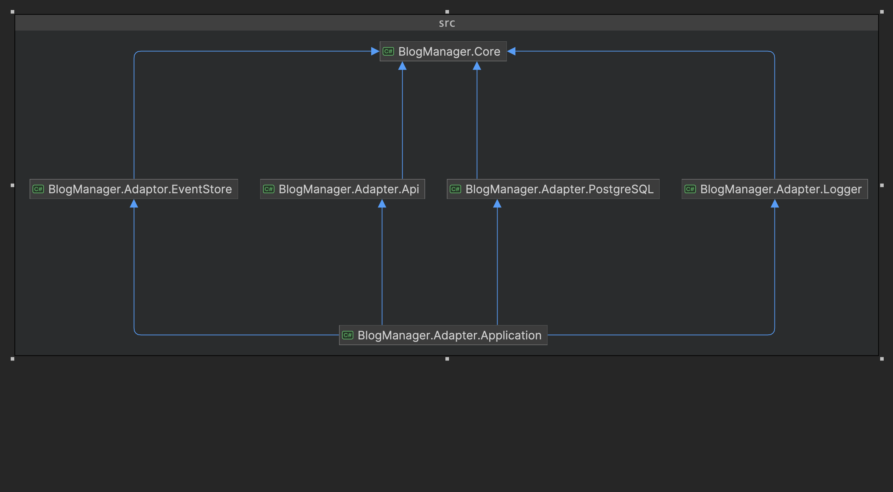
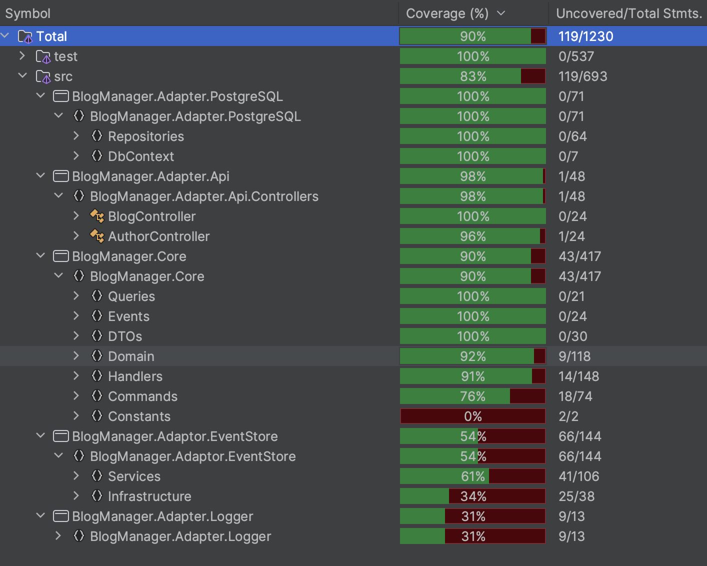

# BlogManager: Implementing Hexagonal Architecture

## Overview

### Technologies and Patterns Used
- Hexagonal Architecture (Ports and Adapters)
- Event sourcing with Event Store DB
- PostgreSQL Database
- Code-First Auto-Migration DB Update when Application Starts
- CQRS Pattern with Mediator
- In-Memory Database for DbContext Testing
- Separate Test Projects for Loosely Coupled Adapters and Ports
- NUnit and Fluent Assertions
- Support for Both JSON and XML Requests and Responses by setting header to `Accept: application/json` or `Accept: application/xml`
- Dockerization
- Logging via Serilog
- Exception Handling Middleware with Logging
- Separate DTOs for Requests and Responses

### Areas for Further Improvement
- Integrate event sourcing along with CQRS for separate read and write databases
- Extract domain rules from domain entities to dedicated Domain (Business) Services for more robust business rule management
- Consider the use of application services as opposed to business logic directly within the application
- History of Data Management by Event Sourcing: Extend the current event sourcing capabilities to include more advanced history services, such as an audit trail, rollback functionalities, and analytical capabilities based on historical data.
## Architecture

The project is built on a Hexagonal (Ports and Adapters) Architecture and is organized into two main folders:


### Source Folder (`src`)
- BlogManager.Core
- BlogManager.Adapter.Api
- BlogManager.Adapter.Application
- BlogManager.Adapter.PostgreSQL
- BlogManager.Adapter.EventStore
- BlogManager.Adapter.Logger

### Test Folder (`test`)
- BlogManager.Core.Tests
- BlogManager.Adapter.Api.Tests
- BlogManager.Adapter.PostgreSQL.Tests
- BlogManager.Adapter.EventStore.Tests
- BlogManager.Tests.Shared

The API project serves as the driver side of the application, while the PostgreSQL and Logger projects function as the driven sides.

#### Key Features:
- In line with Hexagonal Architecture, the Core project is framework-agnostic and fully independent.
- Domain entities such as Author and Blog encapsulate business logic and validation rules.
- Command and Query Handlers are located in the Core project, which also serves as the access point for Repositories.
- Application project serves as the entry point and thus has dependencies on all other projects to eliminate the API project's direct dependency on PostgreSQL repositories.



## Test Coverage

The application boasts over 90% test code coverage. Tests for repositories and the core project use an in-memory database, eliminating the need for actual database dependencies.


## System Requirements

- Docker

## Installation and Usage

To clone the repository, run:

```bash
git clone https://github.com/ekisalar/BlogManagerHexagonalArchitecture
cd BlogManagerHexagonalArchitecture
```

Navigate to your terminal and execute the following Docker commands:

```bash
docker-compose down
docker-compose build --no-cache
(ForWindows: docker-compose -f compose-w build --no-cache)
docker-compose up
```

- The API will be available at http://localhost:8080/swagger/index.html
- The EventStore will be available at http://localhost:2113
- The PostgreSQL database will be available at localhost:5432


